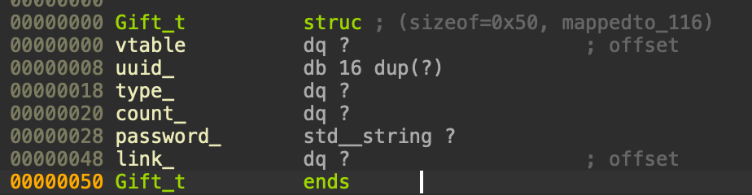

### General description of the service

[Russian version](https://telegra.ph/Reshenie-servisa-perune-s-RuCTF-2023-11-06)

The service is an interface for addressing the god Perun. To make an Prayer, you need to create an Gift. Prayer and Gift are the two main entities of the service available publicly and managed by the user, that is, the user can control their contents. The functionality of the service provides the ability to create a Gift, view a Gift, create a Prayer based on an existing Gift and call the Perun (Call Perune) to see whether Prayer will be performed or not.

The service stores Gift and Prayer as files with names equal to the IDs of these entities. Each entity has its own ID in the UUID format. The data is stored in the database/ directory. Also, with a superficial study of the service (without using reverse engineering tools), you can find a third entity, which is some kind of connection between Gift and Prayer (hereinafter Link). But Link is not accessible to the user in any way and from the point of view of the service, it is hidden, that is, the user can not directly influence its values/state anywhere.

The interface of interaction with the service represents the functions described above.

Let's look at how each of the functions looks from the user's point of view.

#### Make gift 

When creating a Gift, we control three fields of the object: type (enum), quantity (size_t) and password (std::string).

After that, we get the ID of this Gift, it is the attack_data for the service, that is, it is publicly available to all attackers of the service. We can't just view the Gift, since its security is ensured by the presence of a password that is unknown to the attacker.

#### Make prayer

When creating a Prayer, we need to enter the Gift ID-and this Gift should not be connected to another Prayer. We will also be asked to enter the password for the specified Gift. The content of Prayer is just text (std::string).

After creating a Prayer, we will get its ID by which we can perform the Call Perune function.

#### View Gift

When viewing the Gift, we need to specify the Gift ID and password. After that, we will get a display of Gift-a and its Prayer, if there is one.

#### Call Perune

Perun's call is logically necessary in order to fulfill your request if it satisfies certain conditions (they need to be found out by reverse engineering the executable file). In order to make a call, you need to specify the Prayer ID. The call can be successful (as in the picture below), then we will see the contents of our Prayer.

Also, the call may be unsuccessful, then we will see a message that we are a lizard.

#### The logic of the service

The user can create two entities - Gift and Prayer. Viewing the Gift entity is implemented through a function requesting an ID and password for the Gift. Viewing the Prayer entity is implemented through some algorithm that is tied to the content of the Gift. The flag is located in the Prayer entity. Knowing the ID of the Prayer entity, we can get a flag. Knowing the ID of the Gift entity and the password, we can get a flag. Only the ID of the Gift entity is publicly known.

That is, based on the logic of the service, you can immediately identify several attack vectors by which you can get a flag:

1. Try to find out the Gift password or bypass the verification
2. Try to find out the Prayer ID for the desired Gift
3. Find some other binary vulnerability that allows you to read memory or get arbitrary code execution, since the service is binary

We tried to make sure that method 1 and 2 were not implementable and in general tried to get rid of any logical vulnerabilities that could lead to a successful solution of the service, so we only need to search for a binary vulnerability, and for this we need to reverse the application and understand how specifically the functions in the service are implemented and work.

### Analysis of the executable file.

The executable file does not contain a large amount of user code, so you can view the entire code and parse it pretty quickly. All user functions (with the exception of class methods) implemented in the service are shown in the image below.

The main function simply outputs the basic menu and calls the necessary handlers, so we will not give its analysis.

#### MakeGift(void)

This function is called when the option "1" is selected in the main menu. It creates a Gift by accepting data from the user. Let's look at how it works.

We show the user the possible options for the offering and ask him to enter the index. After entering, we go through the switch-case and set the selected type of offering to some variable.

Next, we ask you to enter the quantity for this offering (lines 74-75) and the password (lines 77-89).

After entering the necessary values, we create an object of the Gift class with our arguments (line 91). And also add it to the cache (line 93) using the AddObjectToCache function. At the very end of the function, we display the ID of the created Gift.

From this function, we learned that Gift is described using the Gift class and that we have some cache of objects, as well as that the size of the Gift object is 0x50 bytes (line 90 in the screenshots above).

Consider other interface functions.

#### ViewGift(void)

This function is called when the option "2" is selected in the menu.

At the beginning of the function, we call the GetGift() function, which asks us for the ID and tries to find the necessary Gift in the cache or database, after which it asks for the password.

In the viewing function itself, we simply take out the necessary fields from the object and display them on the screen.

Using methods such as GetCount(), GetGiftType(), GetPassword(), GetLink() we can reliably restore the structure of the Gift object, since we will see which offsets these methods will access.

Let's combine all this and we can create a structure describing the Gift. We get the following structure. The vtable and uuid_ fields appeared because Gift is the heir of the Object class and has visual methods, and the Object class describes any object and has the uuid_ field, which is the ID of the object.

Let's see how this structure will fall on the constructor that is called when creating a Gift.

#### Gift::Gift(...)

As you can see, everything is pretty nice and laid down nicely. Also note that Gift is a descendant of the Object class and has its own virtual table.

Also pay attention to the new Link entity created in line 11-12, you can see its size equal to 0x28 bytes.

This entity is not displayed to the user and exists to link the Gift and Prayer objects.

Let's look at the constructor for Link.

#### Link::Link(...)

Analyzing the constructor, you can come to the following Link structure.

Let's put this structure on the constructor and get the following code.

Link is essentially an Object that has two pointers: one to Gift, the second to Prayer. At the same time, when creating a Gift, we immediately create a Link and put a pointer to the Gift there, and the second pointer will be put down only after creating Prayer.

In case of loading from the Link database, another constructor will be called that initializes the Link from json, however, as for other objects.

Let's summarize a small summary of the current analysis:

- We have some Object class from which Gift and Link (and Prayer) are inherited. This class has virtual methods, which will automatically create a pointer to a vtable in the structure of inherited classes, and Object also has uuid_ fields, which represents the object ID.
- Gift contains fields describing it (type, count, password), as well as a pointer to a Link object that links two entities together.
- Link is an entity of two pointers and it is created in Gift when created from the service (not when loaded from the database) and immediately initializes the pointer to Gift. We don't manage the Link content directly because we don't control its creation (that is, we can't create a Link with arbitrary fields)

Now let's look at how Prayer works.

#### MakePrayer(void)

This function will be called when selecting option "3" in the menu.

At the beginning of the function, we try to get a Gift by the specified ID (this happens inside the GetGift() function) and check if this Gift already has a Prayer set.

The check is implemented by calling the IsLinked() method at Link, this method checks that both pointers are not null.

Next, we enter the text for Prayer (lines 33-43) and create it using the constructor (line 46).

We also get a pointer to Link from Gift (line 44) and pass it to the Prayer constructor. After that, we add Link (line 48-49) and Prayer (line 55) to the cache, and also display the ID of the created Prayer on the screen.

Let's take a look at the Prayer constructor.

#### Prayer::Prayer(...)

In general, nothing interesting, just copy our text, and link Prayer to Link.

The structure of Prayer is as follows.

Great, we figured out how the objects are arranged and how they are connected (using Link), and also learned about some cache. It remains a little unclear what kind of cache this is. Let's take a look at it.

#### AddObjectToCache(Object* pObject)

This function adds any object to the cache. The cache is std::unordered_map<std::string, Object*>. That is, we add an object to the map, where the key is the ID of the object being added, that is, the text representation of the uuid.

The cache is limited in size to 256 elements. The existence of the cache is explained by several things:

1. It has a vulnerability =)
2. When creating Gift and Prayer, they will not be added to the database immediately, but will be located in this cache, so you can protect yourself from spam with files on the system a little
3. If the necessary Gift + Prayer are in the database, then we take them out once and put them in the cache and the next calls to them will already go through the cache, and not the database (which is represented by files)

The cache is reset to the database when the Call Perune completes successfully. And also deletion from the cache occurs when the Call Perune fails. It turns out you need to study what this very Call Perune does.

#### CallPerune(void)

This function starts with reading the Prayer ID and searching for it in the cache and database (lines 20-29). It is also checked that we got Prayer (line 29).

After checking and receiving Prayer, we get a Link and try to get a Gift from it (lines 31-32) and check that we really do not have a null pointer to Gift in our Link (line 33).

Next comes the calculation of points (score) for Gift, this calculation is based on the simplest formula. Each type of Gift corresponds to a certain coefficient of the double type, which is multiplied by the number of Gift (count) and a score is obtained. If this score is less than 1337 (line 35), then we are considered lizards and our Gift and Prayer will be removed from the cache and deleted as objects (lines 42-51).

If we successfully called Perun and our score turned out to be larger, then we will get the output of our text in Prayer and reduce the score in Gift, after which we save our entire cache to the database.

Once again, let's take a closer look at the code called when Perun is called incorrectly. If we look at what happens to the cache, we will see that Gift (line 49) and Prayer (line 43) are removed from it, but Link is not removed. Perhaps it is deleted from the cache in another place, let's see where else the DeleteFromCache() function is called.

It turns out that this is a template function and it had only two instantiations on Gift and Prayer. That is, we lose our Link in the cache. But what happened to him anyway? Let's look at the owner of the Link, that is, the Gift, since he creates the Link in his constructor.

#### Gift::~Gift(...)

The Gift destructor calls the DestroyLink method, let's study it.

#### Method DestroyLink()

This method takes out a pointer to Link (line 6) and checks that it is not null (line 7). After that, we check that our object (and this is a Gift in this case) is still in Link (line 9), if so, then we link it (line 10).

After that, the HasLinked() method is called, which checks whether the pointers are still in the Link (picture below). If Link is empty, then we call the destructor for Link (line 17) and delete the pointer. If there is still some object left in Link, then we will simply take the link field from Gift.

In our case, Prayer is deleted first, and then Gift, that is, at the time of deleting Gift, only it will remain in Link and it will be linked (in line 10), which will lead to the call of the destructor on Link and we will get a situation that in our cache there will be a pointer to an already freed object of size 0x28.

### Vulnerability.

Thus, we get a vulnerability related to the fact that we have a hanging pointer to a freed object in the cache. The Call Perune function will also help us to make UAF (Use After Free) from this primitive.

Let's pay attention to what happens when Call Perune completes successfully.

We call the FluashCacheToDb() function, which should reset the cache to the database, and if we made a hanging pointer, then we will reset it is unclear what, let's see what happens in this function.

We loop through all the objects and call the AddObjectToDb() function for them. Let's take a look at this function.

Let's pay attention to lines 11 and see that the toJSON method from vtable will be called for each object. That is, for our already released object, it will also be called and most likely a SegFault will occur, since there will be completely different data lying there and the pointer to the vtable will simply not be able to be dereferenced.

Let's try to make a trigger with my hands.

#### Trigger.

To do this, we need to do the following steps sequentially

1. Create a Gift with a small count
2. Create a Prayer for Gift from point 1
3. Gift with a large count to pass the Call Perune
4. Create a Prayer for Gift from point 3
5. Make a Call Perune over Prayer from point 2 and get the released Link in the cache
6. Make a Call Perune over Prayer from point 4 and get Segmentation Fault

So we create two Gifts

We get that Gift with ID 3d6606ca-0364-424a-9897-d82b27a3d8fc will not pass verification, and with ID 3e5940e1-6a16-4b9a-9afd-30aaf7287551 will pass.

Next, we create a Prayer for each Gift.

So, we get two Prayers: 22178cc0-045b-4e98-9822-234d0408ab5e (invalid) and f4c3b342-1978-4109-9608- 4c08b42c35a5 (correct)

We make a Call Perune from the wrong one, and then from the right one. The first call will leave the freed Link in the cache, and the second will trigger a call toJSON() from the vtable of the freed object, where some garbage is lying.

We get a segmentation fault, fine, the trigger works. Now we need to think about the exploitation plan.

### Exploitation plan.

So, let's describe our current situation

- There is some freed object on the heap, a pointer to which we have in the cache
- This object has a pointer to a vtable
- The trigger tries to dereference the pointer to the vtable and call the first method from it

We can try to rewrite the pointer to the vtable itself to indicate our new vtable, but there is some problem with this, due to the fact that we do not have any memory leaks and we cannot say exactly where we will control the data and what address they will have. You can pay attention to the fact that the executable file does not have PIE, that is, it always loads its code and data at known addresses, but there does not seem to be any direct entry into the global binar data.

The idea that we used for the solution is that we do such a feng shui on the heap so that in our freed object, a pointer to the heap where our data lies should be placed in the place where the pointer to the table should be. That is, we want to get a situation where our object will be reused by some object that will have a pointer to the data that we control.

That is, the idea is not to directly rewrite the pointer to the vtable, but to get a situation where it will be rewritten by someone else, but to such a pointer where we control the data (in the picture we control the data at 0xff00). This concept is somewhat different from the usual vtable-hijack exploits, because they usually directly rewrite the contents of the released object, but we can't do this because we don't have any leaks and therefore we need to make a neat feng shui so that the pointer itself rewrites to our data. And if it works out, then we will get control over the RIP register and will be able to redirect the execution of the program to any place, but where - we will think further.

So, our current plan is

1. Create the necessary objects and make the released Link in the cache
2. Somehow we make sure that the data we entered is in the place where the pointer will point in the first field of the reused Link object.
3. Write down any address to see that we have gained control over RIP

Let's start implementing this plan. We create two Gifts and two Prayers for them, one will be correct, and the second is not, we need it for the trigger that was described earlier.

We are not paying attention to line 100 yet, we will need it further to get the flag and we will come back to this.

After creating the necessary objects, we need to make a situation with the released Link in the cache. That's why we make a Call Perune.

Now the most important thing is that we must somehow get to the released object with some kind of pointer that will point to the data we entered. At this stage, we are just trying to fit the size of the string there in such a way as to get to the right place.

As a result, we came out with such a way to hit.

leak_gadget in this case is the address of the function inside the vtable.

Let's look at this case in the debugger.

We see that inside the AddObjectToDb() function we have reached the moment of calling the register (calling the virtual method) and we see that the contents of the register are controlled by us.

Now we need to figure out how to get the flag. We tried to find a way to do arbitrary code execution and get RCE, but it didn't work out, in the end we found a gadget that can read the contents of the heap (for this we initially read a Gift with a flag and it is placed on the heap, even if we enter the wrong password).

The gadget that we used in the picture below. It was found by looking at various functions that can display data.

If we pay attention to the register r12 at the moment of calling the virtual method, then it is equal to 1, this is exactly what we need, since we output to stdout. In general, this gadget turned out to be perfect for us and we have been looking for it for quite a long time. The RSI register points to the heap, and RDX also points to the heap and has a large number, which allows you to read a lot of data.

As a result, the full operation plan is as follows:

1. Create two Gift and two Prayer
2. Using attack_data, we read the Gift ID with a flag and enter any password (we just need the Gift to be added to the cache and end up on the heap along with Prayer)
3. Make a Call Perune and create a situation of a released Link in the cache
4. We make a View Gift with ID in the form of a special-sized string in which our gadget lies. This will allow us to get a situation in which the pointer to the vtable becomes a pointer to our chunk
5. Do Call Perune again and trigger the bug

As a result, we will get such a situation.

As you can see in the picture RCX points to our gadget, let's go there and see what the registers look like before calling write.

Everything is as it should be, we will write to stdout and write data from a huge heap.

As a result, we get such an exploit.

Let's describe it by lines.

96 - creating gift1

98 - creating gift2

99 - creating prayer2

101 - make a Gift view by attack_data to put a Prayer with a flag on the pile

103 - doing prayer1

108 - make a Call Perune to get the released Link in the cache

111-112 - fill the heap so as to get a pointer to the vtable in the released Link that will point to our write_gadget

114 - UAF trigger and our gadget call

An example of the execution rallied on the service.

The full exploit can be found in the repository RuCTF 2023 - [https://github.com/HackerDom/ructf-2023/sploits/perune/perune.sploit.py](https://github.com/HackerDom/ructf-2023/sploits/perune/perune.sploit.py)
